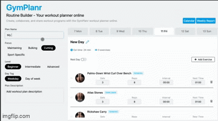

# 🏋️‍♂️ GymPlanr

**GymPlanr** is a modern fitness planning web app that empowers users to create, customize, and manage a weekly workout plan. Featuring real-time drag-and-drop interactions, intelligent exercise filtering, and visual analytics—all wrapped in a sleek, mobile-responsive UI.

---

## 🌟 Features

- 🔍 **Exercise Filtering**  
  Easily filter exercises by **muscle group** or **equipment** using live data from public APIs (ExerciseDB & API Ninjas).

- 📅 **Date-wise Workout Planning**  
  Users can add and manage workouts **per day**, using a simple tab-based layout or calendar selector.

- 🧲 **Drag-and-Drop Exercise Management**  
  Reorder exercises interactively using [`@dnd-kit`](https://dndkit.com/), supporting smooth animations and reordering logic.

- 📊 **Weekly Workout Report**  
  View your weekly summary in a beautiful **line chart** with a color gradient (using Recharts). Shows:
  - Total workout minutes per day
  - 0-minute indicators for rest days

- 💾 **Persistent Storage**  
  All workout data is stored locally using **Redux Toolkit** + **localStorage middleware**—no backend required.

- 🎨 **Modern UI/UX Design**  
  Clean interface built with **Tailwind CSS**, including:
  - **Blurred background modals**
  - Responsive layout
  - Smooth transitions and hover effects

---

## 🛠️ Tech Stack

| Technology       | Version        | Description                              |
|------------------|----------------|------------------------------------------|
| React            | ^18.2.0        | Component-based UI library               |
| Vite             | ^5.0.8         | Lightning-fast dev server & bundler      |
| Redux Toolkit    | ^1.9.5         | Scalable state management with slices    |
| React Redux      | ^8.1.1         | React bindings for Redux                 |
| Tailwind CSS     | ^3.4.1         | Utility-first CSS for layout & styling   |
| @dnd-kit         | ^6.0.6         | Drag-and-drop toolkit for React          |
| Recharts         | ^2.8.0         | Charting library for data visualization  |
| API Ninjas       | -              | Real-time exercise info by muscle group  |
| ExerciseDB API   | -              | Alternative open-source exercise database|

---

## 📦 Getting Started

### 1️⃣ Clone the Repository

```bash
git clone https://github.com/rohan-vimal-iphtech/GymPlanr.git
cd GymPlanr


2️⃣ Install Dependencies
npm install
3️⃣ Start the App
npm run dev
App will be available at: http://localhost:5173

💾 Local Storage Integration
The app uses a custom Redux middleware to sync workout data to localStorage, ensuring:

Persistent data across browser sessions

No need for a backend or database

Instant loading on refresh

📊 Weekly Reports
Uses Recharts for line + area visualization

Shows a breakdown of minutes exercised per day

Color-filled area under the line for emphasis

Rest days display as 0 minutes

🖼️ Sample Meme


"One more rep… because GymPlanr told me to."

📁 Folder Structure (Overview)
/src
├── /components        → Reusable UI components (modals, tabs, cards)
├── /features          → Redux slices (planner, user, filters, etc.)
├── /hooks             → Custom React hooks
├── /pages             → Route-level components (Home, Planner, Report)
├── /redux             → Store setup & middleware
├── /utils             → Helper functions (localStorage, calculations)
└── App.jsx            → Main app layout and routing
